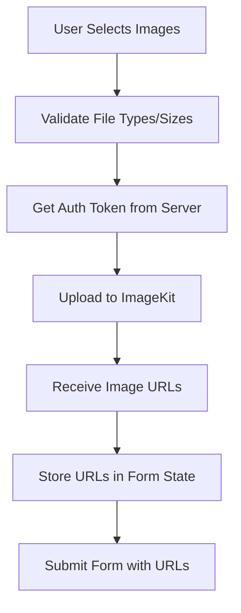

# Property Creation Form - Detailed Implementation Architecture

## 1. ImageKit.io Setup and Configuration

### Required Environment Variables
```env
NEXT_PUBLIC_IMAGEKIT_URL_ENDPOINT=https://ik.imagekit.io/your_imagekit_id
NEXT_PUBLIC_IMAGEKIT_PUBLIC_KEY=your_public_key
IMAGEKIT_PRIVATE_KEY=your_private_key
```

### NPM Packages to Install
```bash
npm install imagekit imagekit-react
npm install react-dropzone
npm install @radix-ui/react-select
npm install @radix-ui/react-checkbox
npm install @radix-ui/react-textarea
```

## 2. Project Structure

```
├── components/
│   ├── ui/
│   │   ├── select.tsx          # New: Select dropdown component
│   │   ├── textarea.tsx        # New: Textarea component
│   │   ├── checkbox.tsx        # New: Checkbox component
│   │   └── file-upload.tsx     # New: File upload component
│   └── property/
│       ├── PropertyForm.tsx    # Main form component
│       ├── ImageUpload.tsx     # ImageKit upload component
│       └── FeatureSelector.tsx # Features multi-select component
├── lib/
│   ├── validations.ts          # Add PropertySchema
│   ├── imagekit.ts            # New: ImageKit configuration
│   └── actions/
│       └── property.actions.ts # New: Property CRUD actions
└── app/manager/create/property/
    └── page.tsx                # Update with PropertyForm

```

## 3. Component Architecture

### 3.1 PropertyForm Component Structure
```typescript
interface PropertyFormData {
  name: string
  price: number
  bedrooms: number
  bathrooms: number
  address: string
  latitude: number
  longitude: number
  rating: number
  type: PropertyType
  features: string[]
  area: number
  images: string[]
  available: boolean
}
```

### 3.2 Form Sections Breakdown

#### Section 1: Basic Information
- Property Name (Input)
- Price (Input with currency formatter)
- Property Type (Select)
- Area (Input with m² suffix)

#### Section 2: Property Details
- Bedrooms (Number Input with increment/decrement)
- Bathrooms (Number Input with increment/decrement)
- Rating (Star rating component or slider)
- Availability (Checkbox)

#### Section 3: Location
- Address (Textarea)
- Latitude (Input)
- Longitude (Input)
- Map Preview (Optional: using Leaflet or Google Maps)

#### Section 4: Features
- Multi-select checkboxes in grid layout
- Grouped by category (Amenities, Security, Views, etc.)

#### Section 5: Images
- Drag & drop zone
- Multiple file selection
- Image preview with delete option
- Upload progress indicator
- ImageKit integration

## 4. ImageKit Integration Architecture

### 4.1 Client-Side Upload Flow


### 4.2 ImageKit Configuration
```typescript
// lib/imagekit.ts
import ImageKit from 'imagekit'

export const imagekit = new ImageKit({
  publicKey: process.env.NEXT_PUBLIC_IMAGEKIT_PUBLIC_KEY!,
  privateKey: process.env.IMAGEKIT_PRIVATE_KEY!,
  urlEndpoint: process.env.NEXT_PUBLIC_IMAGEKIT_URL_ENDPOINT!,
})

// Authentication endpoint for client-side uploads
export async function getImageKitAuthParams() {
  return imagekit.getAuthenticationParameters()
}
```

## 5. Validation Schema

```typescript
// lib/validations.ts
import { z } from "zod"

const MAX_FILE_SIZE = 5 * 1024 * 1024 // 5MB
const ACCEPTED_IMAGE_TYPES = ["image/jpeg", "image/jpg", "image/png", "image/webp"]

export const PropertySchema = z.object({
  name: z.string()
    .min(3, "Le nom doit contenir au moins 3 caractères")
    .max(100, "Le nom est trop long"),
  
  price: z.number()
    .positive("Le prix doit être positif")
    .min(1, "Le prix est requis"),
  
  bedrooms: z.number()
    .int()
    .min(0, "Le nombre de chambres ne peut pas être négatif")
    .max(20, "Le nombre de chambres semble incorrect"),
  
  bathrooms: z.number()
    .int()
    .min(0, "Le nombre de salles de bain ne peut pas être négatif")
    .max(10, "Le nombre de salles de bain semble incorrect"),
  
  address: z.string()
    .min(5, "L'adresse est requise")
    .max(500, "L'adresse est trop longue"),
  
  latitude: z.number()
    .min(-90, "Latitude invalide")
    .max(90, "Latitude invalide"),
  
  longitude: z.number()
    .min(-180, "Longitude invalide")
    .max(180, "Longitude invalide"),
  
  rating: z.number()
    .min(1, "La note doit être entre 1 et 5")
    .max(5, "La note doit être entre 1 et 5"),
  
  type: z.enum([
    "Appartement", 
    "Maison", 
    "Studio", 
    "Immeuble", 
    "Duplex", 
    "Penthouse"
  ]),
  
  features: z.array(z.string()).optional().default([]),
  
  area: z.number()
    .positive("La surface doit être positive")
    .min(1, "La surface est requise"),
  
  images: z.array(z.string())
    .min(1, "Au moins une image est requise")
    .max(10, "Maximum 10 images autorisées"),
  
  available: z.boolean().default(true)
})

export type PropertyFormData = z.infer<typeof PropertySchema>
```

## 6. Server Actions

```typescript
// lib/actions/property.actions.ts
"use server"

import { db } from "@/database/drizzle"
import { properties } from "@/database/schema"
import { PropertySchema } from "@/lib/validations"
import { revalidatePath } from "next/cache"

export async function createProperty(data: PropertyFormData) {
  try {
    // Validate data
    const validatedData = PropertySchema.parse(data)
    
    // Insert into database
    const [newProperty] = await db.insert(properties).values({
      ...validatedData,
      price: validatedData.price.toString(),
      latitude: validatedData.latitude.toString(),
      longitude: validatedData.longitude.toString(),
      rating: validatedData.rating.toString(),
    }).returning()
    
    // Revalidate paths
    revalidatePath('/manager')
    revalidatePath('/estate')
    
    return { 
      success: true, 
      data: newProperty,
      message: "Propriété créée avec succès" 
    }
  } catch (error) {
    console.error("Error creating property:", error)
    return { 
      success: false, 
      error: "Erreur lors de la création de la propriété" 
    }
  }
}

export async function getImageKitAuth() {
  // Server-side auth for ImageKit
  const imagekit = new ImageKit({
    publicKey: process.env.NEXT_PUBLIC_IMAGEKIT_PUBLIC_KEY!,
    privateKey: process.env.IMAGEKIT_PRIVATE_KEY!,
    urlEndpoint: process.env.NEXT_PUBLIC_IMAGEKIT_URL_ENDPOINT!,
  })
  
  return imagekit.getAuthenticationParameters()
}
```

## 7. UI Components Implementation

### 7.1 Select Component (Radix UI)
```typescript
// components/ui/select.tsx
import * as SelectPrimitive from "@radix-ui/react-select"
// Implementation with styling
```

### 7.2 Textarea Component
```typescript
// components/ui/textarea.tsx
import * as React from "react"
import { cn } from "@/lib/utils"
// Implementation with auto-resize
```

### 7.3 Checkbox Component
```typescript
// components/ui/checkbox.tsx
import * as CheckboxPrimitive from "@radix-ui/react-checkbox"
// Implementation with custom styling
```

### 7.4 File Upload Component
```typescript
// components/ui/file-upload.tsx
import { useDropzone } from 'react-dropzone'
// Drag & drop implementation
```

## 8. Features List (African Context)

```typescript
export const PROPERTY_FEATURES = {
  amenities: [
    { id: 'pool', label: 'Piscine', icon: '🏊' },
    { id: 'balcony', label: 'Balcon', icon: '🏠' },
    { id: 'furnished', label: 'Meublé', icon: '🪑' },
    { id: 'ac', label: 'Climatisation', icon: '❄️' },
    { id: 'smart_home', label: 'Domotique', icon: '🏡' },
    { id: 'generator', label: 'Générateur', icon: '⚡' },
    { id: 'terrace', label: 'Terrasse', icon: '🌿' },
    { id: 'garden', label: 'Jardin', icon: '🌳' },
    { id: 'game_room', label: 'Salle de jeux', icon: '🎮' },
    { id: 'gym', label: 'Salle de sport', icon: '💪' },
    { id: 'laundry', label: 'Buanderie', icon: '🧺' },
    { id: 'outdoor_kitchen', label: 'Cuisine extérieure', icon: '🍳' },
    { id: 'garage', label: 'Garage', icon: '🚗' },
    { id: 'elevator', label: 'Ascenseur', icon: '🛗' },
  ],
  security: [
    { id: 'security_24_7', label: 'Sécurité 24/7', icon: '🔒' },
    { id: 'gated', label: 'Résidence fermée', icon: '🚪' },
    { id: 'alarm', label: 'Système d\'alarme', icon: '🚨' },
  ],
  connectivity: [
    { id: 'internet', label: 'Internet inclus', icon: '📶' },
    { id: 'fiber', label: 'Fibre optique', icon: '🌐' },
  ],
  views: [
    { id: 'river_view', label: 'Vue sur le fleuve', icon: '🌊' },
    { id: 'city_view', label: 'Vue sur ville', icon: '🏙️' },
    { id: 'mountain_view', label: 'Vue sur montagne', icon: '⛰️' },
  ]
}
```

## 9. Form State Management

```typescript
// Using React Hook Form with Zod resolver
import { useForm } from 'react-hook-form'
import { zodResolver } from '@hookform/resolvers/zod'

const form = useForm<PropertyFormData>({
  resolver: zodResolver(PropertySchema),
  defaultValues: {
    name: '',
    price: 0,
    bedrooms: 1,
    bathrooms: 1,
    address: '',
    latitude: 0,
    longitude: 0,
    rating: 3,
    type: 'Appartement',
    features: [],
    area: 0,
    images: [],
    available: true,
  }
})
```

## 10. Error Handling & User Feedback

### Toast Notifications
- Success: Property created successfully
- Error: Validation errors, upload failures
- Loading: Upload progress

### Form Validation
- Real-time field validation
- Clear error messages in French
- Field-level error display

### Image Upload Feedback
- Progress bar for each image
- Retry mechanism for failed uploads
- Size and format validation

## 11. Performance Optimizations

1. **Image Optimization**
   - Client-side compression before upload
   - Lazy loading for image previews
   - Thumbnail generation via ImageKit transformations

2. **Form Performance**
   - Debounced validation
   - Optimistic UI updates
   - Progressive form sections

3. **Bundle Size**
   - Dynamic imports for heavy components
   - Tree shaking for unused features

## 12. Accessibility Considerations

- ARIA labels for all form fields
- Keyboard navigation support
- Screen reader friendly error messages
- Focus management
- High contrast mode support

## 13. Testing Strategy

1. **Unit Tests**
   - Validation schema tests
   - Utility function tests

2. **Integration Tests**
   - Form submission flow
   - Image upload process
   - Database operations

3. **E2E Tests**
   - Complete property creation flow
   - Error scenarios
   - Edge cases

## 14. Deployment Checklist

- [ ] Environment variables configured
- [ ] ImageKit account setup
- [ ] Database migrations run
- [ ] Image upload limits configured
- [ ] Error monitoring setup
- [ ] Performance monitoring
- [ ] Security headers configured